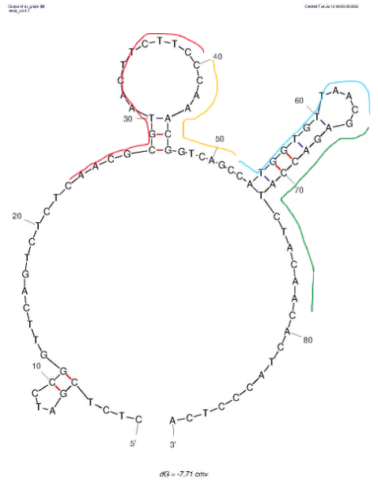
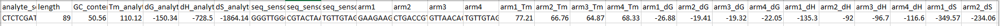
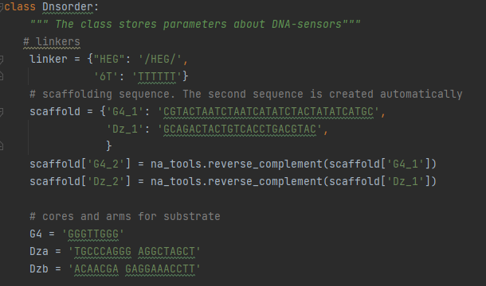

# DNsorder (ver. 1.0)
## Program description
**DNsorder** (**DN**A-sen**sor** buil**der**) is an application enabling the *in situ* choice and assembly 
DNA-sensors based on 10-23 DNAzyme or G-quadruplex.

Based on the input sequence (analyte sequence) provided by the user and parameters of DNA-sensors (*more information in the section 
"Input parameters"*), DNsorder assemble DNA-sensor sequences. 

The program is handy for designing DNA sensors, allowing researchers to pick them up accurately and quickly. 
As a result, the user receives a CSV file containing the information of interest about the input sequence, 
DNA sensor arms and thermodynamic parameters (*more information in the section 
"Output DNA-sensor parameters"*).

## Input parameters
| **flag** | **description**                        | **format** | **example** | **comment**                                                     |
|----------|----------------------------------------|------------|-------------|-----------------------------------------------------------------|
| -a       | analyte sequence                       | str.       | "ATCG..."   | -                                                               |
| -p       | sensor position                        | int.       | 20          | The core position between <br/>the 20th and 21st nt.            |
| -l1...l4 | length of 1st-4th arm                  | int.       | 15          | If to design two arms, <br/>then l3=0 and l4=0                  |
| -c_ar    | arms concentration in nM               | int.       | 20          | -                                                               |
| -tc      | type sensor core <br/>(Dz or G4)       | str.       | "Dz"        | -                                                               |
| -lin     | sensor linker (HEG or 6T)              | str.       | "HEG"       | 6T = TTTTTT                                                     |
| -var     | variant for 3 arms sensor              | int.       | 3           | Adding an arm closer to <br/>the 5' or 3' ends of the position  |
| -c_a     | analyte concentration in nM            | int.       | 20          | -                                                               |
| -c_s     | monovalent cation concentration in mM  | int.       | 215         | [K+] + [Na+]                                                    |
| -c_m     | divalent cation  concentration in mM   | int.       | 100         | [Mg2+]                                                          |
| -t       | temperature of solution, ºC            | int.       | 37          | -                                                               |
| -o       | output folder                          | str.       | "./result"  | -                                                               |
| -s       | save result <br/>(analyte; arms; all)  | str.       | "all"       | There is 4 variant of saving. <br/>To see next section.         |

## Output DNA-sensor parameters
| **name**         | **description**                        | **comment**                                               |
|------------------|----------------------------------------|-----------------------------------------------------------|
| analyte_sequence | analyte sequence                       | -                                                         |
| length           | analyte length                         | -                                                         |
| GC_content       | analyte GC content ssDNA analyte       | -                                                         |
| Tm_analyte       | melting temperature dsDNA analyte      | If the analyte is long, <br/>the calculation is incorrect |
| dG_analyte       | Gibbs energy change dsDNA analyte      | If the analyte is long, <br/>the calculation is incorrect |
| dH_analyte       | enthalpy change dsDNA analyte          | If the analyte is long, <br/>the calculation is incorrect |
| dS_analyte       | entropy change dsDNA analyte           | If the analyte is long, <br/>the calculation is incorrect |
| seq_sensor1-3    | DNA-sensor sequences                   | Including arms, core, scaffold                            |
| arm1-4           | arm sequences                          | -                                                         |
| arm1-4_Tm        | melting temperature duplex arm-analyte | -                                                         |
| arm1-4_dG        | Gibbs energy change duplex arm-analyte | -                                                         |
| arm1-4_dH        | enthalpy change duplex arm-analyte     | -                                                         |
| arm1-4_dS        | entropy change duplex arm-analyte      | -                                                         |
| [arms]           | arms concentration in nM               | -                                                         |
| [analyte]        | analyte concentration                  | -                                                         |
| [cat+]           | monovalent cation                      | [K+] and [Na+]                                            |
| [cat2+]          | divalent cation                        | [Mg2+]                                                    |
| temperature      | temperature of solution, ºC            | -                                                         |

## Installation
Download the entire repository into a separate folder on your laptop.
## Running
There are two ways to run the program. \
The first is to go to the folder where **DNsorder.py** file is and run it with the bellow command through the Linux command line.
```bash
./DNsorder.py
``` 
You will get a form on how to make up a command
```
usage: DNsorder [-h] -a ANALYTE [-p POSITION] [-l1 LEN_ARM1] [-l2 LEN_ARM2] [-l3 LEN_ARM3] [-l4 LEN_ARM4]
                [-c_arm CONC_ARMS] [-tc TYPE_CORE] [-lin LINKER] [-var VARIANT] [-c_a CONC_ANALYTE] [-c_s CONC_SALT]
                [-c_m CONC_MG] [-t TEMP] [-o OUTPUT] -s SAVE [-version]

```
The meaning of each flag is described in the section **"Input parameters"**.
The second way is more convenient. You create a command in a separate file and run it. 
1) Create a file with the extension **.sh**
2) First line, write shebang `#!/bin/bash`
3) Write the command. See the example section. There is also **a test folder** in the repository that has examples of such files.
4) Run the file with the command `./name_file.sh`.
## Example
When you look at the secondary analyte structure and decide what sensor parameters you want, 
you can write the command as below.

\
Figure 1 - ssDNA analyte secondary structure obtained using ["UNAFold"](http://www.mfold.org/).
Colored lines are region for a sensor arms.

```bash
./Dnsorder.py \
-a 'CTCTCGATCCGGTTCAGTCTCTCAACGCGTAACTTCTTCCCAAACGGTCAGCCATGGTGTTAACGAGACCATCTACAACACTACCCTCA' \
-p 51 \           # sensor position
-l1 17 \          # length of 1st (red) arm
-l2 12 \          # length of 2nd (yellow) arm
-l3 13 \          # length of 3rd (blue) arm
-l4 16 \          # length of 4th (green) arm
-c_ar 20 \        # arms concentration in nM
-tc 'G4' \        # G-quadruplex core 
-lin '6T' \       # thymidine linker   
-c_a 1000 \       # analate concentration in nM
-c_s 215 \        # monovalent cation concentration in mM
-c_m 100 \        # divalent cation  concentration in mM
-t 37 \           # temperature of solution, ºC
-o './result' \   # output folder
-s 'all'          # save all results
```
The result will be a CSV file that you can open in Excel.
To display correctly, divide the rows into columns and select the delimiter character ";"


## Comments
If you want to change scaffold sequence. I need to open `core/Class.py` and 
rewrite sequence in "scaffold" dictionary of class Dnsorder (Figure 2).\
\
Figure 2 - screenshot of `core/Class.py` file where you can to replace scaffold sequence. 

## Future Update
1) Set the interval for the length arms 
2) Specify an interval for the sensor position 
3) Insert the scafold sequence yourself in command
